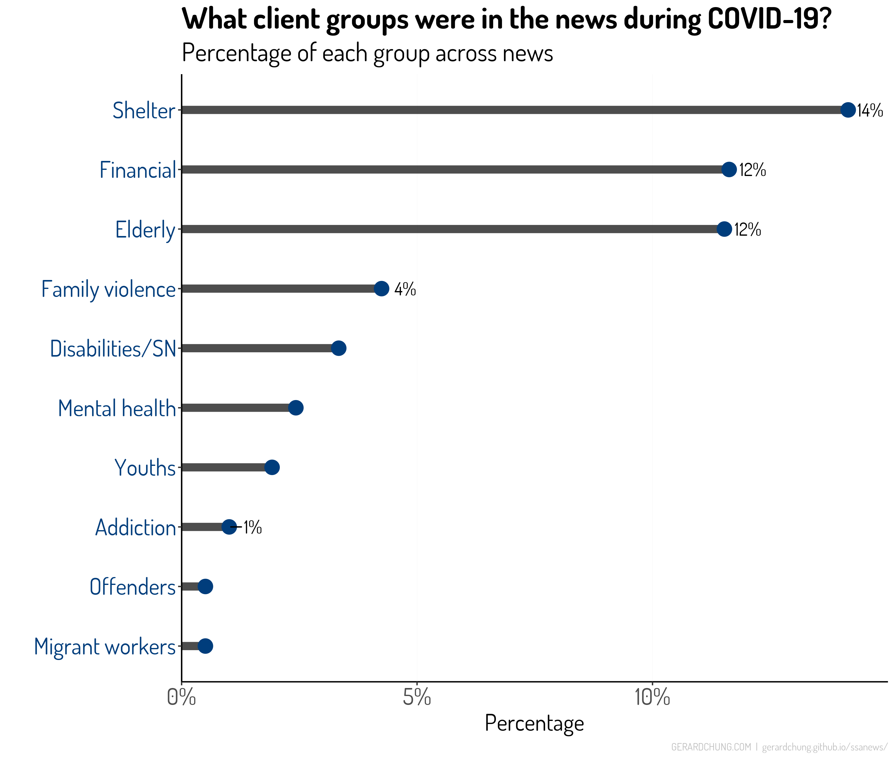

## 
Introduction

### Key Challenges Experienced By SSAs In The Pandemic

In 2021 amid the COVID-19 pandemic, the National Council of Social Service (NCSS)’s in Singapore put out a report titled [“Emerging stronger together”](https://www.ncss.gov.sg/our-initiatives/beyond-covid-19-taskforce) which captured the spirit and vision for social service agencies (SSAs) in this challenging journey. The report by the “Beyond COVID-19” task force (NCSS, 2021) aimed to outline the task force’s recommendations on the strategic capabilities which the social service sector will need to build to emerge a stronger sector in the medium to long term. The recommendations were a result of several studies initiated by the task force to understand the challenges experienced by SSAs during the pandemic, including a survey with executive directors and social service professionals from the SSAs in Singapore. 
 
In the report, **five key challenges** experienced by SSAs were identified: 
> - First, SSAs identified digitalization and IT infrastructure to support service delivery as a challenge in sustaining operations during the pandemic. An upside is that most SSAs see digitalization as an advantage and hope to maintain their organization’s digital transformations in service delivery. 
> - Manpower issues were the second challenge highlighted by SSAs. Staff and volunteer shortages, increased workload, and difficulties with hybrid work arrangements were mentioned. 
> - Third, fundraising and funding sustainability was also a challenge for many SSAs with the survey finding that 67% of SSAs in the sample reporting a decrease in cash donations and 41% incurring a deficit in the last three months. 
> - The last two challenges involved service delivery continuity and the lack of leadership and organizational management capabilities. 

These challenges experienced by SSAs garnered attention in the local newspapers. Media portrayal of these challenges can construct and influence public opinions of the role of SSAs. **The aim of this study is to understand news media representations of SSA and the challenges and issues experienced during the pandemic.**

### News Media Representations Of SSAs And Its Impact On SSAs 

Why are news media representations of SSAs important? Understanding news media representations of social services and social service professionals has been an area of interest in many western countries such as the United Kingdom (UK), Sweden, Ireland, and the United States (Blomberg, 2019; Cordoba, 2017; Gaughan & Garrett, 2012; Leedham, 2021; Reid & Misener, 2001; Staniforth & Beddoe, 2017; Zugazaga et al., 2006). A positive media portrayal of social services could influence SSAs’ effectiveness in service delivery and engagements (Reid & Misener, 2001), especially since most people do not often come into contact with social service professionals such as social workers and counsellors (Zugazaga et al., 2006). **In Singapore, most people form their opinions or get information about SSAs through what they read or hear in newspapers, television, or word of mouth.** The social work profession, for instance, has long been concerned with how it is represented in the media as this can potentially influence service effectiveness, their engagements with client, staff retention, funding for services, and staff recruitment (Legood et al., 2016; Zugazaga et al., 2006). Media representations of the social work profession can have an impact on the conduct and professional practice of social work and influence the public esteem in which social workers are held (e.g., child protection services; Leedham, 2021). By informing and influencing the mood of public opinion, media portrayal may ultimately affect social policy concerning social services, social service professionals, and their clients. News media representations of SSAs could be even more impactful during a crisis such as a pandemic.

### People’s Need For Orientation During A Pandemic
In times of crises, people turn to news sources because they feel the need for information to understand the causes and immediate consequences of the crisis and to know how to reach for safety (Van Aelst et al., 2021). For instance, Althaus (2002) found that in the week after the 9/11 terrorist attacks in the USA, the amount of television network audiences doubled. Several other studies on a range of acute events confirm that people turn to the news in times of crisis (see Van Aelst et al., 2021). **The role of the news media is vital in crises because it can fill people’s needs with immediate and relevant information.**

Depending on the nature of the crisis, the news media can fulfil different functions. For sudden and acute events like natural disasters, people turn to news sources to get guidance on safety. For slower developing events like economic crises or pandemics, people desire news to understand the causes and long-term consequences for society (Van Aelst et al., 2021). **The COVID-19 pandemic, scholars such as Van Aelst et al. (2021) had argued, created a need for both: people were anxious to know about the immediate dangers of this fast-spreading threat; there was also a surge in the need to know how the virus and its public health measures were impacting on the society and the actions to mitigate the impact.** This need among people for orientation in times of crises is explained in a concept in media studies known as the “need for orientation”(Van Aelst et al., 2021). In particular, people’s need for orientation (or sense-making information) would surge if the crisis was perceived to be of high relevance and high uncertainty. 

This need for available and immediate information, according to media systems dependency theory (Ball-Rokeach, 2010), is generally perceived as best satisfied by mass media because it offers speed of transmission and structural connectedness to “expert” sources of information (Van Aelst et al., 2021). In other words, the news media is perceived as important by people as they are seen as a reliable source for swift and accurate expert information, especially in times of high uncertainty and unrest. **In the COVID-19 pandemic, uncertainty about the virus and the health and socioeconomic consequences can trigger anxieties that people try to cope with by seeking for sense-making information and guidance by relying more than usual on local news media sources.** 

### Aims Of This Study
Since the beginning of the COVID-19 pandemic, journalists in Singapore have shifted to a health crisis mode of news coverage. The COVID-19 pandemic in Singapore had been addressed and written about in almost every possible angle: family life, parenting, education, social welfare, health, economics, science, public health, sports, and even celebrity news. **Given the scale of impact of COVID-19 in Singapore, this paper explored how local news media had reported about SSAs in Singapore during the COVID-19 pandemic. I took a broad descriptive approach in understanding the representation of SSAs in the news during the pandemic rather than on specific cases or critical discourse analysis of the role of SSAs.** 

This study used a methodology of **corpus linguistics**, that is, computer-based empirical analyses of language use by employing large collections of written text (Leedham, 2021), to quantitatively answer the following questions:
>1.	What was the average amount of news on SSAs every month during the COVID-19 pandemic?
>2.	What words and parts-of-speech such as verbs and adjectives were used in the news during the pandemic?
>3.	What news topics about SSAs garnered more news attention during the pandemic?
>4.	What client groups were featured in the news on SSAs during the pandemic?
These four questions were explored in the pandemic period and also compared to the pre-pandemic period. 

## 
Method

The analyses used a collection of text data from a total of 1,095 English-language newspaper articles published in the three main news sources in Singapore: Straits Times, Today Online, and Channel News Asia. This section explains how the corpus of text data was built.

### Building The Corpus
The online database of newspapers in Nexis Uni was used to search for any print and online articles based on the following inclusion criteria: (1) published up to one year before 1st February 2020 (date of the first article published about COVID-19 in Singapore) and up to December 2021 (a period of three years from 2019 to 2021), (2) contained key phrases such as “social service*”, “community service*”, or “voluntary welfare” in the title or anywhere in the article, (3) Singapore-based news (i.e., news of COVID-19 not about Singapore are excluded), and (4) published in the English language. 
The initial search gave 1,435 articles. Based on the inclusion criteria and the removal of duplicates, the total number of articles was reduced to 1,095 (325 articles in the pre-COVID-19 period defined as one year before 1st Feb 2020; 770 articles in the COVID-19 period up to December 2021). Text from each article was also tokenized at sentence-level and only those sentences that contained at least one of the key phrases were extracted. This produced a corpus comprising of 1,993 sentences out of the set of 1,095 news articles. Additional meta-data information such as date of publish and titles was also extracted from the raw text and kept with the corpus. 

Detailed descriptions on the articles search in Nexis, raw data extraction , data pre-processing, and analysis as well as codes for replications are provided at https://github.com/gerardchung/ssa_covid_news. 

## 
Findings

### Q1. What was the average amount of news on SSAs every month during the COVID-19 pandemic?

*Figure 1 - Number of news every month.*

#### Increase in news on SSAs during the pandemic compared to pre-pandemic. 
The number of news that mentioned “social service agencies” (also phrases related to voluntary welfare organization* and community service agencie*) increased considerably from January 2020 after the first case of COVID-19 was detected in Singapore. As shown in **Figure 1**, this trend tapers off with the ending of the “Circuit-breaker” partial lock-down in June 2020 and with the transition into Phase 1 Safe-reopening. The monthly number of news then showed a decreasing trend from Phase 2 Safe Transition to Phase 3 Safe Nation. But with the return to Phase 2 (heightened alert) in July 2021, the media attention on SSAs picked up again and the number of news showed an increasing trend up to November 2021. 

These trends clearly show that the amount of media attention on SSAs was related to the tightening or loosening up of public safety measures for COVID-19. Despite the changing trends, subsequent calculations found that the average number of news published on SSAs every month was significantly higher[^2]  during the pandemic period (Mean, M = 33, standard deviation, SD = 14) compared to the pre-pandemic period (M = 25, SD = 10). This is equivalent to almost a 32% increase in the amount of news on SSAs published during the pandemic relative to pre-pandemic. I also examined the number of sentences mentioning SSAs in each article and found that on average, the number of sentences per article mentioning SSAs is significantly higher[^3]  during the pandemic (M = 63, SD = 34) than in pre-pandemic (M = 42, SD = 21). Certainly, a count of the number of news articles each month or the number of sentences may not be the most accurate metric to evaluate the media influence of news. But increased reporting or a clustering of news within a short period is likely to leave a stronger impression of SSAs on the newsreaders.

In a crisis like the COVID-19 pandemic where there are high uncertainty and widespread effects, people felt the need for information to understand the effects of the event and also to know how to reach for help. In later sections, I found that most of the news during the pandemic helped readers to know the kinds of help and how to access the services offered by SSAs (e.g., essential services and help hotlines). Hence, there was a very high media value of such news which is why there was an increase in the media attention given to SSAs, which helped to meet readers’ “needs for orientation” in a crisis. 

  

### Q2. What words and parts-of-speech such as verbs and adjectives were used in the news during the pandemic?

*Figure 2 - Word stems used more during pandemic.*

#### “Shelter*”, “support*”, “fund*”, and “senior*” word stems were used more in news during the pandemic. 
To identify words that increased in use during COVID-19, the number of times that words[^4] appeared in the news were compared between the pandemic and the pre-pandemic period. Every word in the corpus was first reduced to its linguistic root form using word stemming (e.g., “families” and “family” will be reduced to “famili”; “addiction” and “addicted” to “addict”). Subsequently, each word stem’s frequency in the corpus was calculated. **Figure 2** shows that word stems such as “shelter”, “support”, “fund”, “senior”, and “famili” (e.g., supporting, supportive, funds, funding, senior citizens, families) were used more during the pandemic compared to the pre-pandemic period. The increase for “shelter”, “support”, and “fund” was close to 100% more during the COVID-19 period relative to the pre-pandemic period. 

*Figure 3 - Word stems used lesser during pandemic.*
	
On the other hand, some keywords were used lesser in the news on SSAs during the pandemic period. In **Figure 3**, words related to word stems such as “addict” (e.g., addictions, addicted addicts), “disabl” (disability, disabled), “debt”, and “domest_worker” were less used in news during the pandemic compared to the pre-pandemic period. Notably, the word stem “addict” had a 79% decrease in use during the pandemic indicating that less attention was given to topics related to addiction in the context of news on SSAs. These results were reflected again in a later section where I analyzed topics of the news.

#### Verbs and adjectives that were used more in SSA news during the pandemic. 
A more informative way to understand how words are used in newspaper text is to tag each word in accordance with a particular part of speech (POS). In the English language, some of the main POS are adjectives and verbs. In this analysis, I used the Universal tagset for POS tagging and only tagged adjectives and verbs. 

*Figure 4 - Adjectives used more during pandemic.*

From **Figure 4**, we see that the adjectives (i.e., words that describe an attribute of a noun) that increased in news usage during the pandemic period include “national” and “essential”. Subsequent investigations indicate that the “national” adjective often refers to national entities such as National Council of Social Services or National Care Hotline while “essential” often refers to “essential aid” or “essential services”. Other popular adjectives used in the news described client groups. These include “senior”, “homeless”, “vulnerable”, and “rough” (e.g., rough sleepers). The three adjectives “near”, “additional”, and “more” were often used to describe social service delivery and availability such as “nearest family service centre”, “additional funding”, and “more support for families”. 

*Figure 5 - Verbs used more during pandemic.*
	
Verbs in the English language convey action. Thus, tagging words to verbs can help us to understand what actions are often referred to in this collection of news on SSAs. In **Figure 5**, The popular verb “say” was frequently used to quote or cite SSAs or social service practitioners when they were interviewed by journalists for their views of specific social issues (“social service agencies say the greatest need is tackling the isolation faced by vulnerable groups like the elderly”). In the next section, my analysis showed that the “expertise of SSAs” was a popular news topic represented in news media on SSAs. Other verbs (“continue”, “support”, “help”, “apply”) that increased in use during the pandemic referred to help schemes and services that families and individuals can use to cope in the pandemic. 

  

### Q3. What news topics about SSAs garnered more news attention during the pandemic?

*Figure 6 - New topics percentages during pandemic.*

*Figure 7 - New topics percentages comparing pandemic and pre-pandemic.*

#### News during the pandemic gave more attention to SSAs’ expertise role, collaborations, service suspensions, and funding. 
To understand what topics news on SSAs reported on, I sampled and manually read 1,470 sentences (from 829 articles or 75% of the corpus) and categorized each instance’s news topic(s). guided This topic classification was guided by existing studies that used corpus linguistics and qualitative thematic approaches to analyze news portrayal of social services (e.g., Leedham, 2021; Blomberg, 2019). 

**Figure 6** shows that the most prevalent topic reported about SSAs in the news during the pandemic was focused on the expert role of SSAs. Instances of this include news citing social service professionals’ opinions and knowledge about a social problem (“social service agencies and befriending services told the Straits Times they are worried about the elderly like Mr Yuen during the pandemic”). Other news reported about social service professionals offering their expertise as members of task forces to tackle social problems in the community such as family violence or the pandemic. This media emphasis on the expert role of SSAs in Singapore contrasts with a recent study in Australia that found that the majority of news media content relating to social work did not cite social workers, concluding that there is an absence of social workers from the public image of the profession (Cordoba, 2017).

Another prevalent news topic during the pandemic was the collaborations of SSAs with other stakeholders such as governmental agencies, corporate organizations, volunteering groups, or the community. Besides participating in task forces, SSAs are also frequently reported in the news to be actively involved in collaborations to tackle diverse social issues including marriage preparations, poverty, ageing, family violence, and even neighbours’ disputes (“feuding neighbours living in Bukit Merah will be linked by a neighbourhood police centre to a social service agency at an early stage before the dispute escalates and ends up in court”). SSAs were often cited by the news on their desire to collaborate more with the community (e.g., “neighbours can serve as the first line of help for people with hoarding problems, alerting social service providers to issues, Ms Goh said, adding: "we cannot do this alone.").

The remaining topics often reported in the news on SSAs were similar to the reported challenges experienced by SSAs described in the “Emerging stronger together” report by the Beyond COVID-19 task force. The COVID-19 pandemic and public health measures including the “Circuit-breaker” partial lock-down had led to challenges in service delivery for all or most SSAs that include service suspensions, restrictions to services leading to higher service demands, funding difficulties, and manpower issues such as reduced staff hiring and volunteers, social service professionals’ burnt-out and mental health issues. A recent survey with frontline social workers from various SSAs across Singapore found that during this pandemic, a high percentage of social workers experienced symptoms related to depression, anxiety, and stress (Seng et al., 2021). 

Thus, when the percentage prevalence of topics during the pandemic period was compared to the pre-pandemic period (see **Figure 7**), it was not surprising to see that relative to the pre-pandemic period, there was a large increase in percentage points for topics such as “service suspensions”, “service demands”, “helplines” (e.g., National Care Hotline), and digitalization in SSAs. However, it was surprising to find that there was lesser focus in the news on SSAs’ role of expertise, collaborations, and future development plans for the social service sector during the pandemic relative to the pre-pandemic period. Though this study cannot adequately explain this, one possible explanation is that with the developing pandemic, journalists gave more editorial space to reporting news (e.g., service disruptions) on the immediate and far-reaching effects of the pandemic which had more media value. It is also possible that due to service suspensions or restrictions in the social service sectors, this resulted in fewer opportunities for SSAs to engage in collaborations and partnerships during the pandemic. 

#### Balanced or mostly positive portrayals of SSAs.

Overall, the news on SSAs during the pandemic has been mostly neutral or positive about the image or role of SSAs. While news on service suspensions or manpower issues may create public images of a social service-in-crisis, the majority of the news continue to emphasize the continued presence and the expertise of SSAs, their ongoing collaborations with stakeholders to tackle social issues, the availability of help despite restrictions (e.g., National CARE hotline and essential services), and funding support (e.g., NCSS’s Invictus pandemic fund) for SSAs to continue to deliver critical services. The media portrayal of SSAs in Singapore seem to be more balanced in presenting an image of the negative as well as the positive things that happen in the social service sectors. This has not been the case in other countries such as Sweden (Blomberg, 2019) where “social service-in-crisis” was the dominant theme in media portrayal of SSAs. Or such as in the UK where an analysis of 2,000 news articles of social services and social workers found them to be “overwhelmingly negative and critical” (Franklin, 1998, p. 5)

  

### Q4. What client groups were featured in the news on SSAs during the pandemic?

*Figure 8 - Client groups in news during pandemic.*

*Figure 9 - Client groups in news comparing pandemic and pre-pandemic.*

#### Client groups reported in the news during COVID-19.
	
In **Figure 8**, clients with financial difficulties, those with shelter needs such as rough sleepers, and elderly persons were the three client groups that were featured the most in the news during the pandemic. These three groups together garnered almost 40% of the news focus. Comparing these results with the pre-pandemic period give us additional insights (see **Figure 9**). First, the three client groups increased in news focus during the pandemic when compared to the pre-COVID-19-period. Elderly persons and those experiencing financial difficulties had about 5 to 6% more attention in the news. Second, family violence had an increase of 2% compared to the pre-pandemic period. The risk for family violence was higher during the pandemic because as some studies in Singapore had found, there were increased marital conflicts, higher parenting stress, and increased use of harsh parenting during the pandemic (Chung, Chan, et al., 2020; Chung, Lanier, et al., 2020). 

Third, persons with addictions, those with mental health issues, youths, migrant workers, and persons with disabilities or special needs had the least media attention in news on SSA during the pandemic. This was even lesser relative to the pre-pandemic period. In Singapore, the prevalence rate of persons with disabilities ranges from 2.1% to 13.3% depending on the age category of the population group (Ministry of Family and Social Development, 2018). The COVID-19 pandemic has the potential to significantly increase the daily challenges of people with disabilities and may have a greater impact compared to the general population. Partial lock-downs such as the Circuit-breaker and social distancing measures can also be risky for the development of individuals’ mental health issues. Substance use and addictive behaviours (e.g., overeating, gambling, alcohol) may increase as ways to cope with the stress, isolation, and anxiety wrought by the pandemic. I note that the lesser media attention given to these client groups in news about SSAs does not imply that SSAs do not engage these groups. Instead, it could mean that the needs of these groups were not as publicized in the public sphere during the pandemic. Proactive media strategies should be considered by SSAs to improve public attention to these needs, to the appropriate services and to the role of SSAs in engaging these client groups. 

Finally, the many client groups represented in the news – both in the pre-pandemic and pandemic period - represent the complexity of issues and the diverse client groups that SSAs in Singapore engage with and deliver services to. This challenges the conclusions present in other literature of other countries suggesting that media news were mostly focused on social services working with children, particularly of children in child protection situations (e.g., Leedham, 2021). 

## 
Discussion

#### What are the key findings from this analysis of news on SSAs in Singapore during the pandemic? 
> - A significant increase (+32%) in the number of news on SSAs during the pandemic. 
> - Increase in media usage of words related to “shelter”, “support”, “fund”, “famili” and “senior”.
> - Increase in the use of adjectives that describe national entities (“National”; e.g., NCSS or National Care hotline), that describe client groups (“senior”, “homeless”, “vulnerable”), and those that describe accessibility to/availability of services (“more”, “near”, “additional”).
> - Increase in the use of verbs that describe actions about how client groups can access services and help given by SSAs (“apply”, “continue”, “help”, “support”, “receive”) and verbs related to the “voice” of social service professionals that demonstrate their expertise (“say”).
> - News topics about SSAs during the pandemic include service suspensions and restrictions, funding matters, manpower issues (staff recruitment, staff burnt-out, volunteers), and the digitalization of service delivery. 
> - Two news topics with the highest prevalence were SSAs’ expertise role and collaborations with other stakeholders. Though, relative to pre-pandemic, these two topics were given lesser focus during the pandemic. 
> - Client groups with financial difficulties, shelter needs, and senior citizens were the three most featured groups garnering almost 40% of the media attention during the pandemic. 
> - Clients with addictions, mental health issues, and disabilities or special needs had the least news media attention during the pandemic. This was also lesser compared to the pre-pandemic period. 
> - The many client groups represented in the news represent the complexity of issues and diverse client populations that SSAs engage with.

For many Singaporeans and residents living here, the local newspapers are a significant source of information on the role of SSAs. The proliferation of online media opens up more opportunities for readers to access this news. News media are seen as a reliable source for fast and accurate expert information, particularly in times of high uncertainty. During this COVID-19 pandemic where there was high uncertainty about its development and effects, individuals’ need for information about the role of the SSAs becomes even more relevant and critical to make sense of the situation and to get guidance for help. Hence, I found in this study that the news material during the pandemic had focused on uplifting the role of SSAs as experts and emphasizing the continuity of SSAs in providing critical services to diverse client groups especially among those with financial difficulties or shelter needs, and the elderly. While the media has presented to some extent an image of social service-in-crisis, this was also balanced with positive news of SSAs such as additional funding for SSAs, emphasizing the expertise of SSAs, their active collaborations, as well as the continuity of services in the community through this pandemic period. 

News media and news journalists play an important role in shaping public opinion and its understanding of the role of SSAs in Singapore. This has one important implication for SSAs. SSAs can consider a more proactive media strategy to promote its image and services, not merely for the sake of improving its profile, but to improve engagement with clients, service delivery as well as to advocate for the needs of clients. The media’s positive representations of SSAs can influence public acceptance of social service practices, improve social service professionals’ job esteem and their engagements with clients and colleagues (Legood et al., 2016). This, consequently, can affect people’s interest in joining the profession and also staffs’ retention in the social service sectors. Negative portrayals of SSAs might affect clients’ motivations in using social services, especially in times of crises where people seeking help need to trust in the role of SSAs. The inadequate media attention given to certain client groups or social issues may limit public awareness and support for these groups.

What does a proactive media strategy looks like? This may include considering the material interests of news media companies, understanding the process of news creation, and building relationships with news journalists (Cordoba, 2017)[^5]. One study in the UK interviewed social workers and they recommended that more needed to be done actively to identify and utilise success stories, and provide a more accurate insight into the role and the extensive training of those in the profession (Legood et al., 2016). To my best knowledge, no study in Singapore has looked at how social service professionals experience public perception. A future study can help to understand how social service professionals here experience public perception and explore what are the ways to promote SSAs and social service profession in Singapore. 

## 
References

- Althaus, S. L. (2002). American News Consumption during Times of National Crisis. PS: Political Science and Politics, 35(3), 517–521. JSTOR.
- Ball-Rokeach, S. J. (2010). Media System Dependency Theory. In The International Encyclopedia of Communication. John Wiley & Sons, Ltd. https://doi.org/10.1002/9781405186407.wbiecm051
- Blomberg, H. (2019). “We’re not magicians!” On the use of rhetorical resources in Swedish news media narratives portraying the social services and social workers. Qualitative Social Work, 18(2), 229–246. https://doi.org/10.1177/1473325017710324
- Chung, G., Chan, X. W., Lanier, P., & Ju, P. W. Y. (2020). Associations Between Work-Family Balance, Parenting Stress, and Marital Conflicts During COVID-19 Pandemic in Singapore [Preprint]. Open Science Framework. https://doi.org/10.31219/osf.io/nz9s8
- Chung, G., Lanier, P., & Wong, P. Y. J. (2020). Mediating Effects of Parental Stress on Harsh Parenting and Parent-Child Relationship during Coronavirus (COVID-19) Pandemic in Singapore. Journal of Family Violence. https://doi.org/10.1007/s10896-020-00200-1
- Cordoba, P. S. (2017). Representations of Social Work in the Australian News Media. Australian Social Work, 70(4), 453–464. https://doi.org/10.1080/0312407X.2017.1324886
- Franklin, B. (1998). Hard Pressed. The Manson Group, Reed Business Information.
- Gaughan, L., & Garrett, P. M. (2012). The ‘most twisted and unaccountable force in the state’? Newspaper accounts of social work in the Republic of Ireland in troubled times. Journal of Social Work, 12(3), 267–286. https://doi.org/10.1177/1468017310383269
- Leedham, M. (2021). ‘Social Workers Failed to Heed Warnings’: A Text-Based Study of How a Profession is Portrayed in UK Newspapers. The British Journal of Social Work, bcab096. https://doi.org/10.1093/bjsw/bcab096
- Legood, A., McGrath, M., Searle, R., & Lee, A. (2016). Exploring How Social Workers Experience and Cope with Public Perception of Their Profession. British Journal of Social Work, 46(7), 1872–1889. https://doi.org/10.1093/bjsw/bcv139
- Ministry of Family and Social Development. (2018, November 19). Total number of persons with disabilities in Singapore. Media Room. https://www.msf.gov.sg/media-room/Pages/Total-number-of-persons-with-disabilities-in-Singapore.aspx
- National Council of Social Services. (2021). Emerging Stronger Together—A Guide Beyond COVID-19. National Council of Social Services. https://www.ncss.gov.sg/docs/default-source/ncss-publications-doc/pdfdocument/emerging-stronger-together-guide.pdf
- Reid, W. J., & Misener, E. (2001). Social work in the press: A cross-national study. International Journal of Social Welfare, 10(3). https://doi.org/10.1111/1468-2397.00172
- Seng, B. K., Subramaniam, M., Chung, Y. J., Syed Ahmad, S. A. M., & Chong, S. A. (2021). Resilience and stress in frontline social workers during the COVID-19 pandemic in Singapore. Asian Social Work and Policy Review, 15(3), 234–243. https://doi.org/10.1111/aswp.12237
- Staniforth, B., & Beddoe, E. (2017). Five years in the news: A media analysis of Child, Youth and Family in two daily newspapers (2008–2012). Aotearoa New Zealand Social Work, 29(4), 5–18. https://doi.org/10.11157/anzswj-vol29iss4id382
- Van Aelst, P., Toth, F., Castro, L., Štětka, V., Vreese, C. de, Aalberg, T., Cardenal, A. S., Corbu, N., Esser, F., Hopmann, D. N., Koc-Michalska, K., Matthes, J., Schemer, C., Sheafer, T., Splendore, S., Stanyer, J., Stępińska, A., Strömbäck, J., & Theocharis, Y. (2021). Does a Crisis Change News Habits? A Comparative Study of the Effects of COVID-19 on News Media Use in 17 European Countries. Digital Journalism, 9(9), 1208–1238. https://doi.org/10.1080/21670811.2021.1943481
- Zugazaga, C. B., Surette, R. B., Mendez, M., & Otto, C. W. (2006). SOCIAL WORKER PERCEPTIONS OF THE PORTRAYAL OF THE PROFESSION IN THE NEWS AND ENTERTAINMENT MEDIA: AN EXPLORATORY STUDY. Journal of Social Work Education, 42(3), 621–636. https://doi.org/10.5175/JSWE.2006.200500502

## 
End Notes

[^1]: See discussion on text preprocessing in Chung, G., Rodriguez, M., Lanier, P., & Gibbs, D. (2021, May 11). Text-mining open-ended survey responses using structural topic modeling: A practical demonstration to understand parents’ coping methods during COVID-19 pandemic in Singapore. https://doi.org/10.31219/osf.io/enzst

[^2]: Non-parametric test with Wilcoxon signed-rank test indicated that this difference is statistically significant (p = .008).

[^3]: Non-parametric Wilcoxon signed-rank test indicated that this difference is statistically significant (p = .02)
	
[^4]: More accurately, I generated and analyzed n-grams phrases (1 to 3-grams; e.g., senior, activity, activity_centre, senior_activity_centre) since n-grams better capture semantic contexts than single words (i.e., 1-gram). For instance, “domest_worker” 

[^5]: The National Association of Social Workers (NASW) in the US has often been cited as a case study of a successful proactive media approach where NASW developed the NASW’s National Communications Network and the SocialWorkersSpeak.org website. For many years, NASW has actively developed and maintained positive relationships with the media through different initiatives such as media monitoring, providing consultation, industry awards, and support for filmmakers and journalists. 

