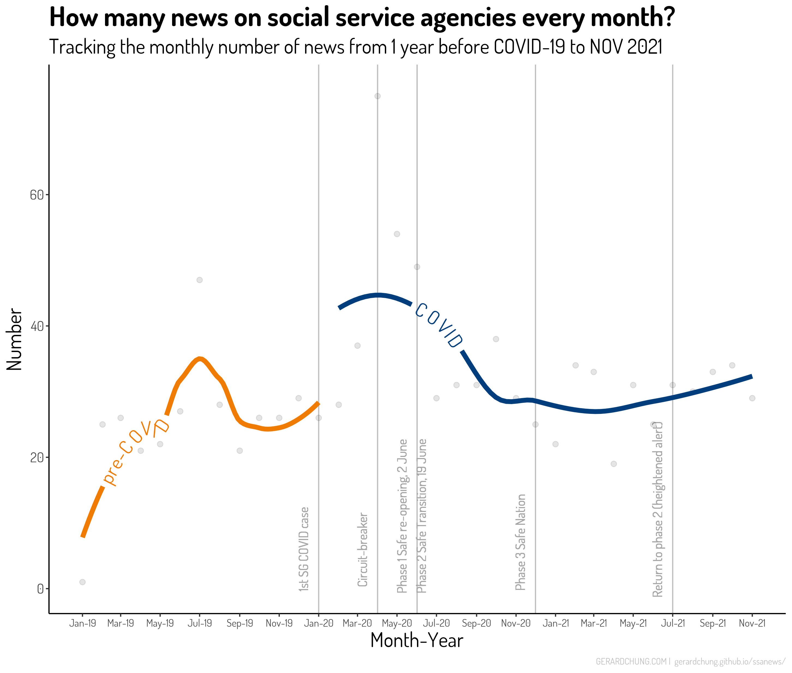

##<center>Introduction</center>
In the year 2021 in the midst of the COVID-19 pandemic, the National Council of Social Service (NCSS) in Singapore put out a report titled [“Emerging stronger together”](https://www.ncss.gov.sg/our-initiatives/beyond-covid-19-taskforce) which encapsulated the spirit and vision for social service agencies (SSAs) in this challenging journey during the COVID-19 pandemic. The report by the “Beyond COVID-19” taskforce convened by the NCSS aimed to outline the taskforce’s recommendations on the strategic capabilities which the social service sector will need to build to emerge a stronger sector in the medium to long term. Several studies were also initiated by NCSS to find out what are the challenges experienced by SSAs during the pandemic in Singapore, including a survey with executive directors and social service professionals from SSAs. Four key challenges experienced by SSAs were identified: 
1. First, SSAs identified digitalization and IT infrastructure to support service delivery and telecommuting as a challenge in sustaining operations during the pandemic. Nonetheless, an upside is that most SSAs see digitalization as an advantage and hope to maintain organization’s digital transformations in service delivery. 
2. Manpower issues ranging from staff and volunteer shortages, increased workload, and difficulties with hybrid work arrangements were the second challenge highlighted by SSAs. A recent survey with frontline social workers from various social service sectors across Singapore found that during this pandemic, a high percentage of social workers experienced symptoms related to depression, anxiety, and stress. More importantly, higher levels of perceived organizational support were associated with less psychological distress among these social workers (Seng et al., 2021). 
3. Third, fundraising and funding sustainability was also a challenge for many SSAs with the survey finding that 67% of SSAs in the sample reporting a decrease in cash donations and 41% incurring a deficit in the last three months. 
4. The last two challenges that SSAs reported experiencing involved issues related to service delivery continuity and the lack of leadership and organizational management capabilities. 


## Methods
The analyses used a dataset of English-language news articles published in the three main news media sources in Singapore: Straits Times newspapers, TodayOnline, and ChannelNewsAsia. The online database of newspapers in Factiva was used to search for any print and online articles based on the following criteria: (1) published up to one year before 1st February 2020 (date of the first news article published about COVID-19 in Singapore) and up to December 2021 (almost three years in duration), (2) contained key phrases “social service*”, “community service*”, or “voluntary welfare*” in the title or anywhere in the article, (3) Singapore-related news (i.e., news of COVID-19 not about Singapore are excluded), and (4) published in English language. Based on these criteria and removal of duplicates, the total number of news articles was 1,095 (325 articles in pre-COVID-19 period defined as one year before 1st Feb 2020; 770 articles in COVID-19 period up to December 2021). I then tokenized the text at sentence-level and extracted every sentence that contained at least one of the three key phrases. This produced an analytical corpus comprising of 1,993 sentences out of a set of 1,095 news articles. 
	The analyses in the present study were done using various natural language processing (NLP) techniques (e.g., ngrams, parts of speech tagging) and structural topic modeling. I provided a full description of the text preprocessing and NLP procedures, replicable codes, and software packages used on https://gerardchung.github.io/ssanews/ 


## Findings
Findings


*Figure 1 - Average number of news every month.*

More news about SSAs were published during COVID-19. The number of news that mentioned “social service agencies” (including voluntary welfare organization* and community service agencie*) increased considerably from January 2020 after the first case of COVID-19 was detected in Singapore. As shown in Figure ?, this trend tapered off with the ending of the Circuit-breaker partial lock-down and with the transition into Phase 1 Safe-reopening. The monthly number of news then showed a decreasing trend from Phase 2 Safe Transition to Phase 3 Safe Nation. But with the return to Phase 2 (heightened alert), the attention on SSAs picked up again and the number of news increased at least until November 2021. What is clear from these trends is that the amount of local media attention on SSAs was related to the tightening or loosening up of public safety measures for COVID-19. In a later section, I found that most of the news were about the overwhelming service demands and service suspensions faced by SSAs. Aside from the ups and downs of trends, I calculated that the average number of news published on SSAs each month was significantly higher[^1] in the COVID-19 period (Mean, M = 33, standard deviation, SD = 14) compared to the pre-COVID-19 period (M = 25, SD = 10) . This is equivalent to almost a 32% increase in the amount of news on SSAs published in the COVID-19 period. 

[^1]: Non-parametric test with Wilcoxon signed-rank test indicated that this difference is statistically significant (p = .008).

## Welcome to GitHub Pages

You can use the [editor on GitHub](https://github.com/gerardchung/ssanews/edit/main/README.md) to maintain and preview the content for your website in Markdown files.

Whenever you commit to this repository, GitHub Pages will run [Jekyll](https://jekyllrb.com/) to rebuild the pages in your site, from the content in your Markdown files.

### Markdown

Markdown is a lightweight and easy-to-use syntax for styling your writing. It includes conventions for

```markdown
Syntax highlighted code block

# Header 1
## Header 2
### Header 3

- Bulleted
- List

1. Numbered
2. List

**Bold** and _Italic_ and `Code` text

[Link](url) and 
```

For more details see [Basic writing and formatting syntax](https://docs.github.com/en/github/writing-on-github/getting-started-with-writing-and-formatting-on-github/basic-writing-and-formatting-syntax).

### Jekyll Themes

Your Pages site will use the layout and styles from the Jekyll theme you have selected in your [repository settings](https://github.com/gerardchung/ssanews/settings/pages). The name of this theme is saved in the Jekyll `_config.yml` configuration file.

### Support or Contact

Having trouble with Pages? Check out our [documentation](https://docs.github.com/categories/github-pages-basics/) or [contact support](https://support.github.com/contact) and we’ll help you sort it out.
